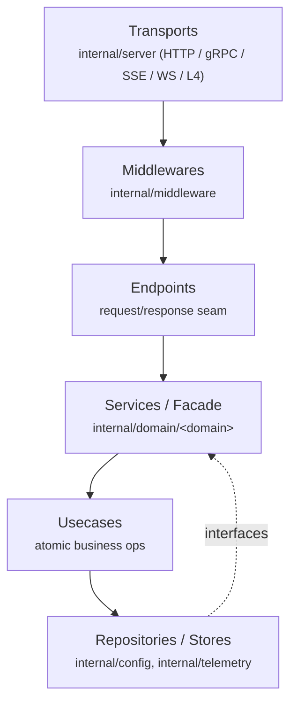
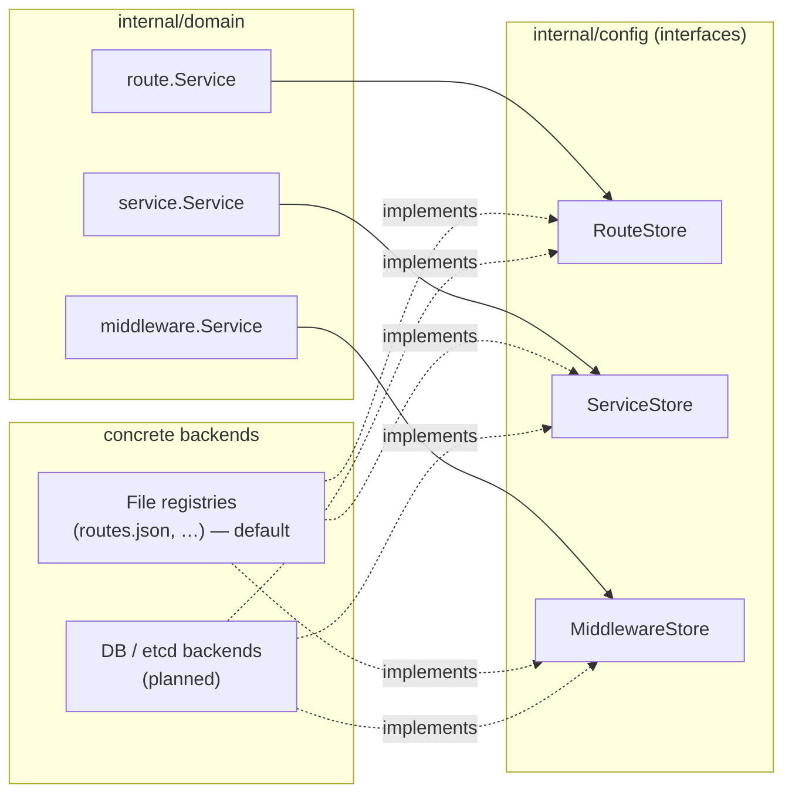
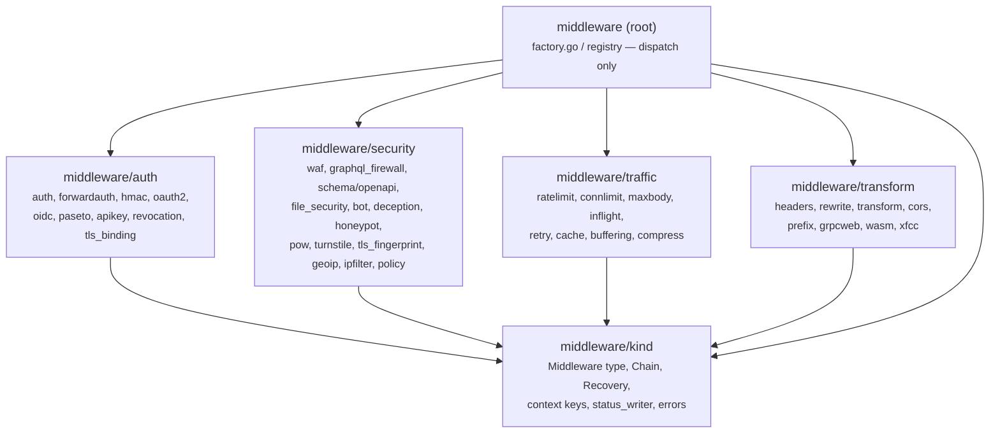

# Gateon Architecture & Dependency Diagram

This document complements the [ADRs](./adr/README.md) with a visual overview of
Gateon's layered architecture, the request path, and the **target** grouping of the
`internal/middleware` package (see [ADR-0002](./adr/0002-middleware-package-refactor.md)).

## Layered execution flow

Per [ADR-0001](./adr/0001-layered-architecture.md), a request flows top-to-bottom and
dependencies point downward only (no layer depends on a layer above it).

## Configuration store interfaces

Per [ADR-0003](./adr/0003-config-store-interfaces.md), domain services depend on
per-domain `Store` interfaces, not on concrete backends.

## Target `internal/middleware` package layout

The package is being split in safe stages (ADR-0002). The **target** dependency graph
is acyclic: subpackages depend only on the `kind` leaf, and the root `middleware`
package depends on the subpackages (registry/dispatch), never the reverse.

### Why the staged approach

A flat-to-nested move fails to compile because the current `Middleware` type lives in
`package middleware` while `factory.go` (also in `package middleware`) would import any
new subpackage — an `import cycle`. Stage 0 extracts the cycle-free core into the
`kind` leaf package (with temporary type aliases for backward compatibility), after
which each cohesive group can be moved and verified (`go build ./... && go test -race
./...`) one shippable step at a time.

## Related documents

- [ADR-0001 — Layered architecture](./adr/0001-layered-architecture.md)
- [ADR-0002 — Middleware package refactor](./adr/0002-middleware-package-refactor.md)
- [ADR-0003 — Config store interfaces](./adr/0003-config-store-interfaces.md)
- [recommendations.md](./recommendations.md) — execution roadmap (Session 7).
